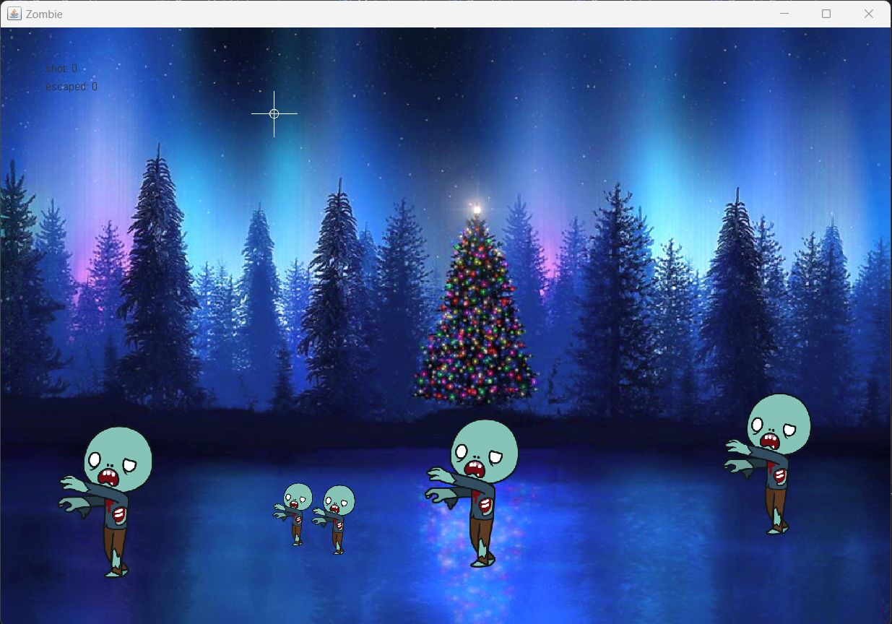
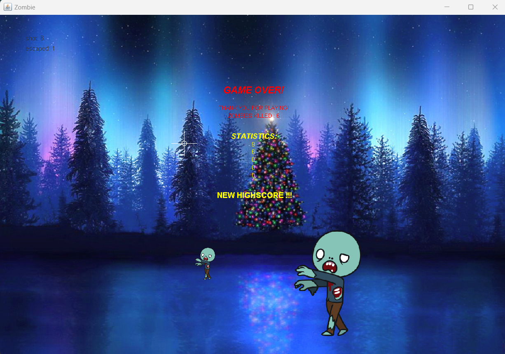
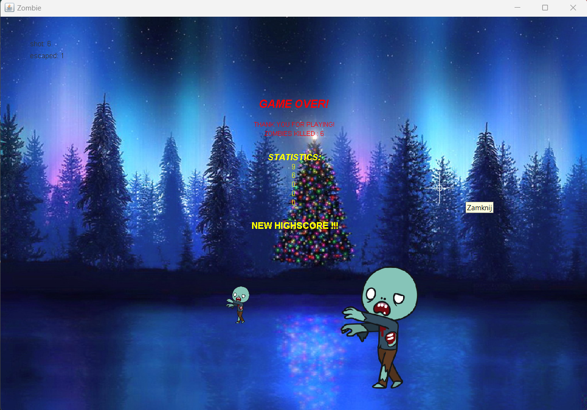

# Java Zombie Shooter Game

This is a simple 2D Zombie Shooter game implemented in Java where you shoot zombies moving from right to left. The game ends if too many zombies escape from the screen.

## Features

- Arcade-style shooting gameplay
- Zombies spawn from the right side of the screen and move leftwards
- Player can shoot zombies using the mouse
- Increasing difficulty as the game progresses (zombies move faster)
- Score tracking
- Top 5 scores stored locally in csv file.
- Game over when too many zombies escape

## Requirements

- Java Development Kit (I used JDK 21)

## Installation

1. Clone the repository:

git clone https://github.com/TomaszStr/java-zombie.git

2. Open the folder in Java IDE e.g. IntellJ

3. You can start the game with Main() method.

## Screenshots

